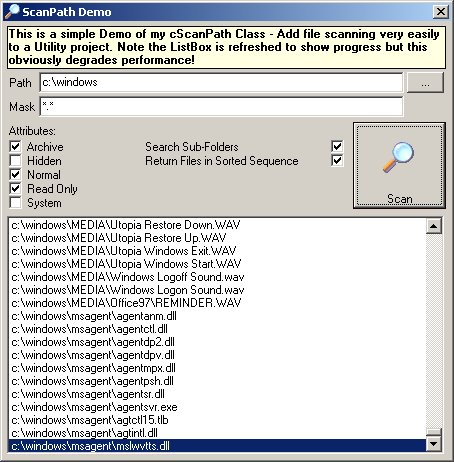



## ScanPath \(demo of cScanPath Class\)

### Description

Fast API based file finder. Class scans a path (with Attributes, Mask, Date, Size filter properties) and returns the files &amp; folders by raising events. Optionally scan nested sub-folders and sort results. Created to make File Utility creation very rapid. Hope it may be useful as example of API file handling and WithEvents. I welcome feedback!
 
### More Info
 

             |
---                |---
**Submitted On**   |2005-05-15 05:05:00
**By**             |[Richard Mewett](https://github.com/Planet-Source-Code/PSCIndex/blob/master/ByAuthor/richard-mewett.md)
**Level**          |Intermediate
**User Rating**    |5.0 (55 globes from 11 users)
**Compatibility**  |VB 6\.0
**Category**       |[Files/ File Controls/ Input/ Output](https://github.com/Planet-Source-Code/PSCIndex/blob/master/ByCategory/files-file-controls-input-output__1-3.md)
**World**          |[Visual Basic](https://github.com/Planet-Source-Code/PSCIndex/blob/master/ByWorld/visual-basic.md)
**Archive File**   |[ScanPath\_\(1889395182005\.zip](https://github.com/Planet-Source-Code/richard-mewett-scanpath-demo-of-cscanpath-class__1-60535/archive/master.zip)

